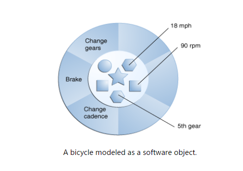

## Review of Chapter 1

### Operator:

1. **Assignment**  v.s.  **Comparison** operators

   ```java
   int a = 3, b = 4;
   a == b  // current value of a?
   a = b   // current value of a?
   ```

2. **Casting**

   * Ex. 4

3. **Round-off**

   * Ex. 8

4. **单目算数关系逻辑赋值**

   * ``1+8 > 7-8 && 1-1 < 3+7  ``
   * Ex. 5

5. Control structure
   ```java
   int a = 90; // always put one space around operators, accroding to coding style
   if (a > 80) { 
   	System.out.println("a > 80");  // always use curly brackets,even for one line
   }
   if (a > 90){
   	System.out.println("a > 90");
   } 
   else {
   	System.out.println("a < 80"); 
   }
   ```

6. **Logical operator**

   * Ex. 11 & 12

7. Hexadecimal <-> Decimal 

   * Ex. 8

8. **Debugging in Eclipse**

   *  Ex. 21

9. Java SE API Documentation

   * http://www.oracle.com/technetwork/java/javase/documentation/api-jsp-136079.html


## Chapter2: Classes and Objects

### Object and class

* **Object**: An object is a software bundle of related **state** and **behavior**.

  

* **Class**:  Blueprint for implementing objects
  * An object is a single instance of the class
  * In Java, a variable that represents an object is called an **object reference**

#### Encapsulation

*    In class: 

     * **state**: data fields
     * **Behavior**: methods
*    Combine data and method into a single unit class: **encapsulation**
*    Benefit of encapsulation

     *    **Modularity** : The source code for an objectcan be written and maintained independently of the source code for otherobjects. Once created, an object can be easily passed around inside the system.

     *    **Information-hiding** : By interacting onlywith an object's methods, the details of its internal implementation remainhidden from the outside world.

     *    **Code re-use** : If an object already exists(perhaps written by another software developer), you can use that object inyour program. This allows specialists to implement/test/debug complex,task-specific objects, which you can then trust to run in your own code.

     *    **Pluggability and debugging ease** : If aparticular object turns out to be problematic, you can simply remove it fromyour application and plug in a different object as its replacement. This isanalogous to fixing mechanical problems in the real world. If a bolt breaks,you replace *it*, not the entire machine.


#### Access specifier

*  ``public``
   * Public class is usable by all client programs. If not, only be used by class in its own package.
   * Public methods are accessible to all clientprogram.

*  ``private``

   * Private variables can be accessonly by methods of that class.

*  ``static`` **THINK TWICE ABOUT THIS CONCEPT**

   * A static variable contains a value that is shared by all instances of the class.

   * Memory allocation happens once.

#### Information hiding

However, client are not privy to the class implementation and access the private variables and methods.

#### Diffs between static and non-static

1.  When the class is loadedmember variable is initialized, associated with the class.
2.  A static variable separately divided a storage space, the storage space is shared by all objects of a class.
3.  When created a new object, non-static variables are divided storage space.
4.  ``ClassName.staticVariable``   v.s. ``objectName.nonStaticVariable``

### Methods

 ``image here``

#### Type of methods

* Constructors
  * How to identify: 
    * The same name as the class, and no return type.
    * ``default constructor`` has no parameters: provides reasonable initial/default values for an object
    * ``the constructor with parameters``:  sets the instance variables of an object to the values of those parameters  
  * Functionality: 
    * *Implicitly** called when **creating an object(instance) of /instantiating/initializing**  a  class. 
    * ``new `` operator returns the address  in memory of the newly constructed object. (p.102)
  * Example:  
    * ``BankAccount b = newBankAccount()``
    * ``b`` stores the address of ``BankAccount`` object. Not the object itself.
  * ``image preferred``
* ACCESSORS

Access a class object withoutaltering the object. Return some information about object

* MUTATORS

   Change the state of an object by modifying atleast one of its instance variables.

   Dot operator b.withdraw();

### Static methods vs instance methods

1.        When the class is loaded member variable isinitialized, associated with the class.

A static variable separately divided a storage space, thestorage space is shared by all objects of a class.

2.        When created a new object, non-static variablesare divided storage space.

3.        Instance methods: all operate on individualobject of a class.

4.        Static methods: a method that performs anoperation for the entire class. Not individual object.

5.        Recall instance method, object.methodname()

* Call static methods: ``ClassName.staticMethodName();``
* Static methods in a driver class

   A class contains main() is used to test otherclass.

   Create no objects. 

Method overloading

In the same class have the samename but different parameter lists.

 

Method’s signature

   Method’s name and a list of parameter types.

   The return type of the method is irrelevant.

   Error: twomethods with identical signature but different return 

 

Scope:

   The region in which that variable or method isvisible and can be accessed.

   Instance variables, static variable, and methodsbelong to class’s scope.

   Local variable is defined inside a method.Automatically recycled.

   Local variables take precedence over instancevariables with the same name.

 

The this keyword

 

Reference vs primitive data types

   Primitive data type: int, double…  

   Reference data types: object

   The way they are stored is different 

ü  Aliasing

Two references for the sameobject.

Use new to create a second object

### The nullreference

* An uninitialized object variable 
* Test: ``BankAccount b; If(b==null) ``
* failed to initialize 
  * local variable: compile-time error
  * instance variable
    * primitive type: provide reasonable default values ( 0 for numbers, false for booleans)
    * ref. type: set to null
* NullpointerException

### Method parameters

* Formal vs Actual Parameters
  * Formal Parameter (**Parameter**): **the header of a method** defines the parameters of that method. Placeholder
  * Actual Parameter (**Argument**): supplied by a particular **method call** in a client program.
  * Note: 
    * the number of arguments must **equal** the number of parameters
    * the type of each arguments must be **compatible** with the type of each corresponding parameter
* Passing primitive types as parameters: passed by value/ by creating a new memory slot


* Passing objectsas parameters: Copy the address

 

### Summary

