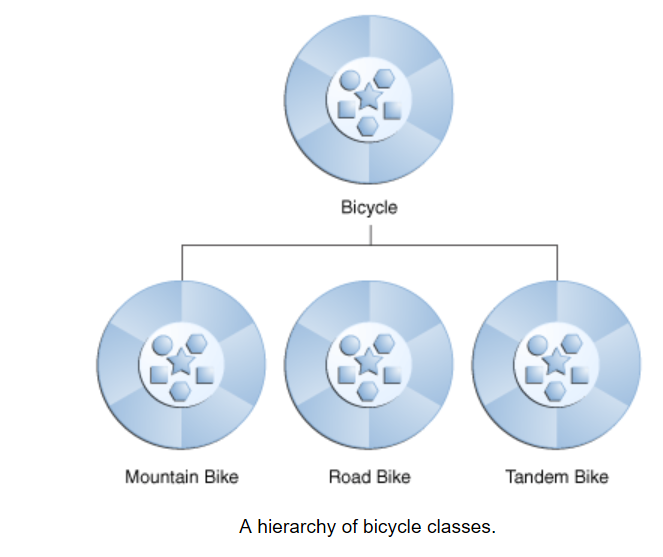
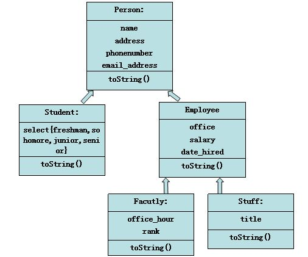
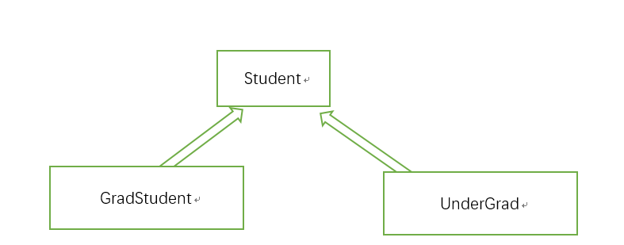

# Revision of Chapter 2

## Please Always ...      

* Always keep aligned with **Chapter Goals** in Barron textbook and [**AP Java Subset (PDF)**](https://secure-media.collegeboard.org/digitalServices/pdf/ap/ap-computer-science-a-java-subset.pdf)

## Chapter Goals
### Objects and classes

* state: variables / data
* behavior: methods
* **encapsulation**

### Keywords ``private``, ``public`` and  ``static``
```java
// BankAccount.java
public class BankAccount
{
  // variables here, either instance or static
  // methods here, either instance or static
  public static void print(){
    // method implementation here
  }
}
// Main.java
BankAccount b1 = new BankAccount();
b1.print(); // right or wrong?
```

### Methods

*   Constructors(**default, with parameters**), accessors, mutators

* Static methods

* Method overloading
* The **signature** of a method: the methods' name + a list of the parameter's types, e.g.

      ​```java
      product(int)
      product(double)
      product(int, int)
      ​```

  * True or false? 
      * Two overloaded methods in the same class must have parameters with different name. 
      * Two different constructors in a given class can have the same number of parameters. 

### References

* primitive data types <-> reference data types

* All parameters in Java are passed by **value** (as opposed to the case in C++).

* **aliasing**: having two references for the same object

* p116.10  

* Read the following code: 

  ```java
  int a = 2;
  int b = a;
  BankAccount b1 = new BankAccount();
  BankAccount b2 = b1;
  BankAccount b3 = new BankAccount();
  ```

* **Formal** vs **actual** parameter

  ```java
  //BankAccount.java
  public class BankAccount()
  {
    public void print(int account,string password){
      // TODO
    }
  }
  //Main.java
  BankAccount b1=new BankAccount();
  b1.print(2222.00,"skdhsdjs",222); // anything wrong?
  ```


* instance variable, static variable, and methods of a class belong to the class's **scope**
* local variable:
  * during execution of the method, the parameters are local to the method. b
  * Any changes made to the parameters will not affect the value of the arguments in the calling program. 
  * when the method is exited,the local memory slots for parameters are eased.
* p114.8    p117.13   p125.23

# Chapter 3: Inheritance and Polymorphism

## Inheritance

* Definition: defines a relationship between objects that share characteristics.

* Specifically, a new class (**subclass**) is created from an existing class (**superclass**)

* example : dog---animal 

  
  (Source: http://docs.oracle.com/javase/tutorial/java/concepts/inheritance.html)

  

* Inheritance Hierarchy:

* "is-a" relationship
  * transitive: denoted with arrow, opposite is not true

* Benefit: code reuse/ subclass only need to focus on new code required.


### Implementing Subclasses

* keyword: ``extends``

  * Inheriting instance methods and variables:

    * Subclasses **do not inherit ** the private instance variable or private methods of their superclass.
    * Objects of subclass contain memory for private instance variables, even though they cannot access them directly.
    * a subclass can invoke public accessor or mutator . 

  * Class on the same level in a hierarchy diagram do not inherit anything from each other.

  * p151.1


#### Method overriding

*   definition: a method in superclass is overridden in a subclass by definition a method with same return type and signature(name and the list of parameter types)

  * partial overriding: subclass method wants to do what superclass does, plus something extra.

    ``super.computeGrade()``

  * private methods cannot be overridden


#### constructors and `super`

* **constructors are never inherited!**

* if no constructors in subclass?
  * the superclass default constructor with no parameter is generated.
  * superclass only have a constructor with parameter,**error**.

* a subclass method can be implemented with calling the super method.
  * ``super() / super(para1, para2, ...)``

  * note : **in constructors**, ``super()`` is used in subclass constructor,must be used in **first line.**

  * if no constructors is provided in the subclass, the compiler provides the following default constructors.

    ```java
    public SubClass()
    {
      super();
    }
    ```

* p151.2 \3\4

* **coding**: in other methods , we can use ``super.methodName()``


#### declaring subclass objects



* a ``GradStudent`` is-a ``Student``; an ``UnderGrad`` is-a ``Student``

* Superclass does not inherit from a subclass.

  ```java
  /* 
    Superclass as the type of the object reference;
    SubClass as the type of the actual object.
  */
  Student s = new Student();
  Student g = new GradStudent();
  Student u = new UnderGrad();
  // GradStudent and UnderGrad both inherit the setGrade() from Student
  s.setGrade("Pass"); // ok
  g.setGrade("Pass"); // ok
  u.setGrade("Pass"); // ok
  // Only GradStudent has getID() method
  g.getID(); // ok
  s.getID(); // invalid
  u.getID(); // invalid
  ```


* a ``Student`` is not necessarily a ``GradStudent`` nor an ``UnderStudent``

  ```java
  GradStudent g = new Student(); // invalid
  UnderGrad u = new Student();  // invalid
  ```


## Polymorphism

* Definition: a method has been overridden in at least one subclass. eg, ``computeGrade()``

* It is the mechanism of selecting the appropriate method for a particular object.

* Method calls are always determined by **the type of actual object**, not the type of object reference.

  ```java
  s.computeGrade();
  g.computeGrade();
  u.computeGrade();
  ```

* selection of the correct method occurs during **run of the program**.

### Dynamic Binding (late Binding)

* definition: making a run-time decision about which instance method to call.

* Comparison between **overloaded** and **overridden**

  * overloaded:
    * select correct overloaded method at compile time by comparing **method signature**
    * static binding,**early binding**
  * overridden:
    * definition a method with same return type and signature(name and parameter types) in subclass.
    * actual method is called **not** by the compiler.
    * the compiler determines if a method can be called (such is legal??),while the run-time environment determines if it will be called.
  * page139 Example2
  * p152 8


### Type compatibility

#### Downcasting

```java
Student s  = new GradStudent();
GradStudent g = new GradStudent();
int x = s.getID(); // invalid
int y = g.getID(); // ok
int x = ((GradStudent) s).getID(); // finally valid, by casting s to the correct type
```

* WHY??
  * ``Student`` class does not have a ``getID() ``method 
  * at compile time,only non-private methods of ``Student`` class can appear to the right of the dot operator.

* Definition: Casting a **superclass** to a **subclass** type is called a **downcast**.

* Note: 

  ```java
  int x=(GradStudent)s.getID(); // cause error!! 
  // dot operator has higher precedence than casting.
  ```

* p152.7   p153.9


#### Rules for polymorphic method calls

  ```java
  SuperClass a = new SubClass();
  a.method(b);
  ```

* type of a at compile time is ``SuperClass``, at run time is ``SubClass``.
* at compile time ,method must be found in the class(SuperClass) of a,if not, u need an explicit cast.
* for a polymorphism method,at run time the actual type of a is determined.
* the type of b is checked at compile time.


#### The ClassCastException

* definition: a run-time exception thrown to cast an object to a class of which is not an instance.

  ```java
  Student u =new UnderGrad();
  System.out.println((string)u);   // ClassCastException
  int x =((Gradstudent)u).getID();
  ```


## Abstract Class

* definition: an abstract class is a superclass that represents an abstract concept.And should not be instantiated.
* abstract methods:`public abstract double area();`
  * no implementation code,just a header
  * a placeholder
  * every subclass need to override this method.
* if a class contains any abstract methods,it must be declared an abstract class.

  `public abstract class AbstractClass{.......}`

* if a subclass does not provide implementation code for all abstract methods,it must become an abstract class.

  `public abstract class SubClass extends AbtractClass{......}`

* note: 

  * it is possible for an abstract class to have no abstracts methods.
  * an abstract class may or may not have constructors.


## Interfaces

* definition: a collection of related methods whose headers are provided without implementation. All of the methods are both public and abstract. some examples.
* a class  **implements** an interface need to implement **all the methods** in the interface.
* if cannot implement all the method,the class must be declared abstract.

  ```java
  public interface FlyingObject
  {
    void fly();
    boolean is Flying();
  }
  ```

  ```java
  public class Bird implements FlyingObject
  {
    .....
  }
  ```

  ```java
  public class Mosqutio extends Insect implements FlyingObject
  {
    .....
  }
  ```

* Note:

  * the extends clause must precede the implements clause.

  * a class can have only one super class, but can **implement any number of interfaces**:

    ```java
    public class SubClass extends SuperClass implements Interface1, Interface2,.......
    ```


## Interface vs. Abstract class

1. Use an abstract class for an object is application-specific but incomplete without its subclass.
2. using an interface when its method are suitable for your program but could be equally applicable in variety of programs.
3. an interface does not provide any implementations for its methods,whereas an abstract class does.
4. an interface cannot contain instance variables,whereas an abstract class can .
5. it is not possible to create an instance of an interface object or an abstract class object.

## Summary

* u can write subclass ,given any superclass.
* design, create, modify a class that ` implements ` an interface
* ``super.methodName()/super()``: both in writing constructors and calling methods of superclass.
* understand polymorphism : when methods have been overridden in at least one subclass.
* explain the difference between the following concepts:
  * an abstract class and an interface
  * an overloaded method and overridden methods
  * dynamic binding (late binding ) and static binding (early binding )
